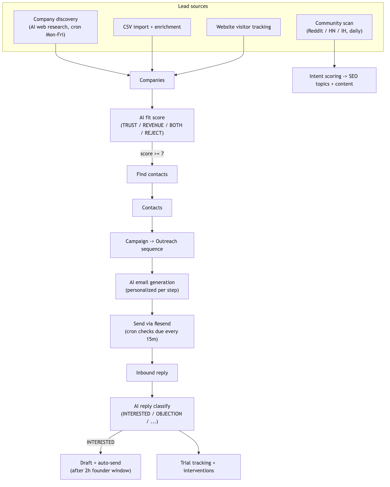
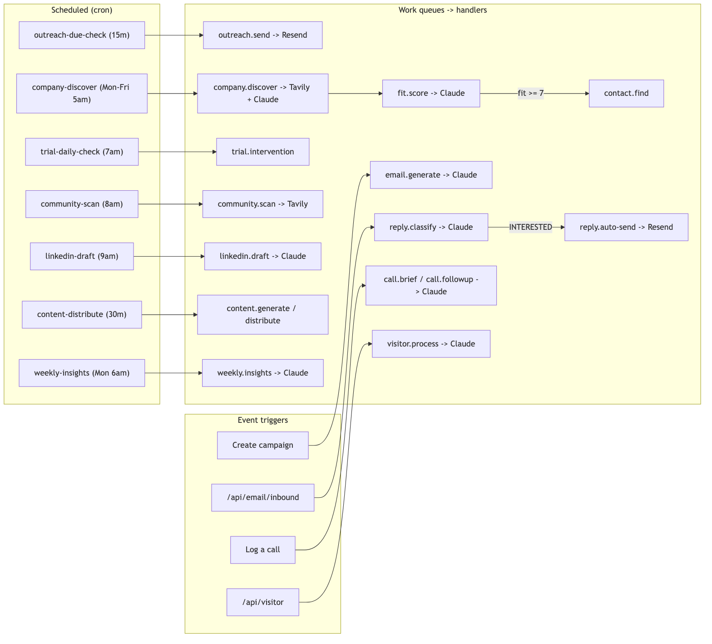
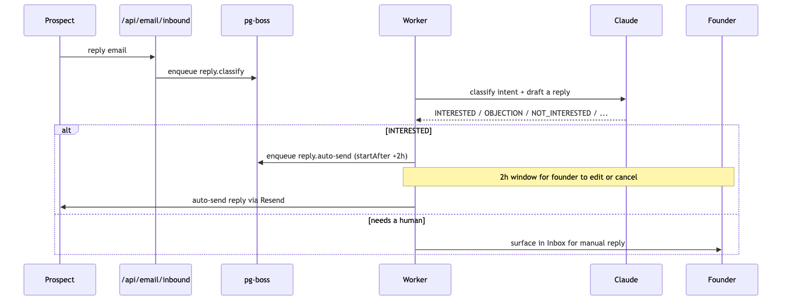
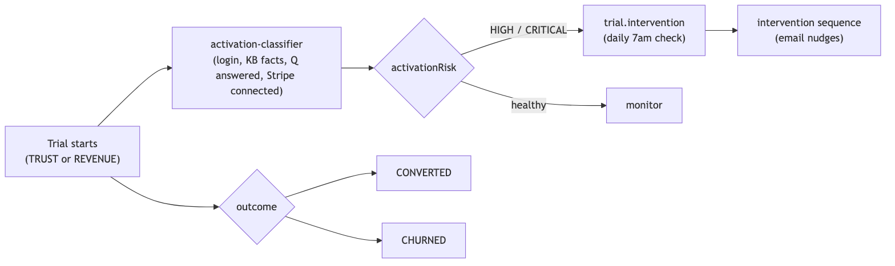
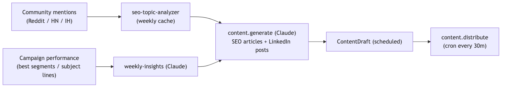
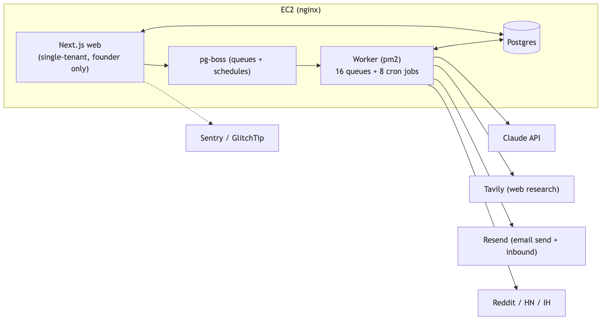

# Korrali Growth — End-to-End Flow

Internal founder tool for outbound, trials, and content ops across Korrali Trust + Revenue. **Not customer-facing, no billing.** Diagrams use Mermaid.

## The growth engine (high level)

## Async pipeline — pg-boss queues and cron triggers

## Inbound reply loop

## Trial lifecycle and intervention

## Content and demand engine

## Infrastructure

---

**One-line summary:** AI discovers and fit-scores companies, finds contacts, writes and sends personalized outreach, classifies replies, nudges at-risk trials, and generates content — all as pg-boss queues driven by cron schedules and webhooks, for the founder's eyes only.
